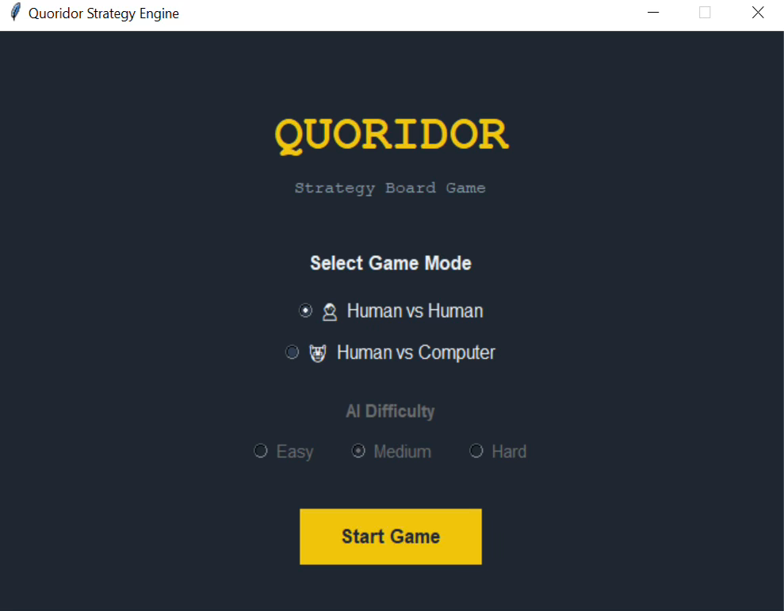
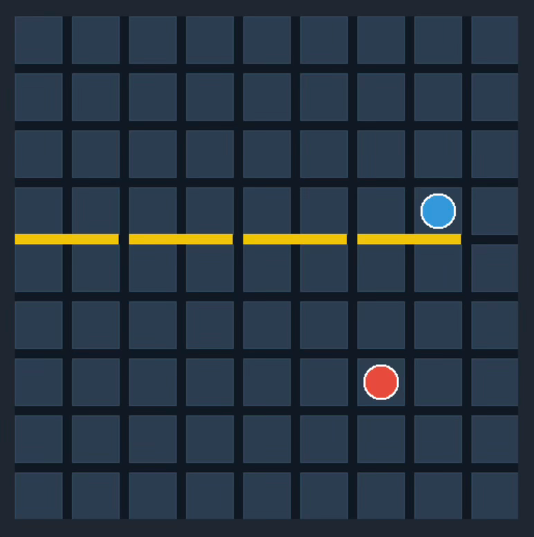
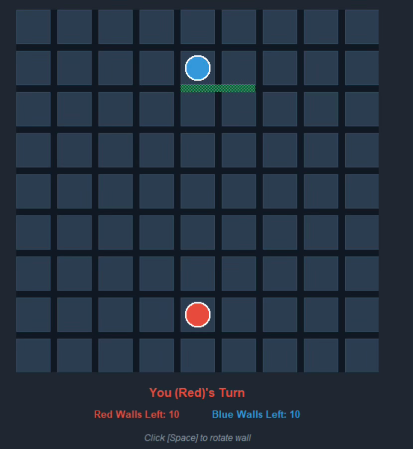
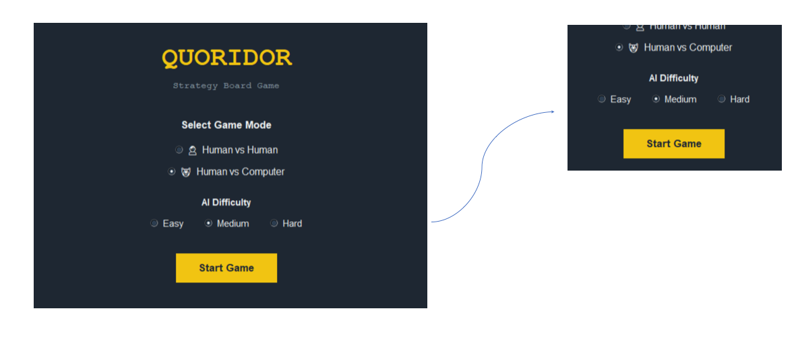

# Quoridor Strategy Engine

A full implementation of the abstract strategy board game **Quoridor**, developed using **Python** and **Tkinter**. The project supports both **Human vs Human** and **Human vs AI** gameplay, featuring three AI difficulty levels and an interactive graphical user interface.

---

## Game Description

Quoridor is a two-player strategy board game played on a 9×9 grid. Each player starts at the center of their baseline and aims to reach the opposite side of the board before their opponent.

On each turn, a player may either:

- Move their pawn one square orthogonally (up, down, left, or right).
- Place a wall to block the opponent's path.

Walls cannot overlap, cross existing walls, or completely block a player's path to their goal. The game uses pathfinding validation to ensure that both players always have at least one valid route to victory.

---

## Screenshots

### Main Menu



### Gameplay Board



### Wall Placement Preview



### Human vs AI Mode




---

## Installation & Running

### Requirements

- Python 3.8+
- Tkinter (usually included with Python installations)

### Steps

```bash
# Clone the repository
git clone https://github.com/monawalied/Quoridor_Game.git

# Navigate to the project directory
cd Quoridor_Game

# Run the game
python main.py
```

---

## Controls

| Action | How to Perform |
|----------|--------------|
| **Move Pawn** | Click on a valid destination square |
| **Place Wall** | Hover near a cell edge and click |
| **Rotate Wall** | Press `Space` to switch between Horizontal and Vertical |
| **Undo Move** | Click the **Undo** button |
| **Redo Move** | Click the **Redo** button |
| **Reset Game** | Click the **Reset Game** button |
| **Return to Menu** | Click the **Main Menu** button |

---

## Game Modes

### Human vs Human

Two players compete locally on the same computer, taking turns moving pawns and placing walls.

### Human vs Computer

Play against an AI opponent with three difficulty levels:

#### 🟢 Easy

Uses a greedy strategy that always attempts to move closer to the goal.

#### 🟡 Medium

Combines greedy movement with strategic wall placement when the human player gains an advantage.

#### 🔴 Hard

Uses the **Minimax Algorithm with Alpha-Beta Pruning** to evaluate future game states and make strategic decisions.

---

## Bonus Features


### Undo / Redo Functionality

An Undo/Redo system has been implemented to improve gameplay usability.

Features include:

- Reverting previous moves and wall placements.
- Restoring previously undone actions.
- Preserving the complete game state, including:
  - Player positions
  - Wall placements
  - Remaining wall counts
  - Current turn information
- Supporting multiple consecutive Undo and Redo operations.

---

## Project Structure

```text
Quoridor_Game/
│
├── main.py          # Entry point
├── board_ui.py      # GUI and user interactions
├── game_logic.py    # Core game rules and pathfinding
├── ai.py            # AI algorithms and decision making
├── screenshots/     # README images
└── README.md
```

---

## Technical Features

- Complete implementation of Quoridor game rules
- BFS pathfinding validation for legal wall placement
- Human vs Human gameplay
- Human vs AI gameplay
- Three AI difficulty levels
- Minimax with Alpha-Beta Pruning
- Interactive wall placement preview
- Undo/Redo functionality
- Reset game option
- Main menu navigation
- Modern Tkinter graphical interface

---

## Demo Video

[Watch the Demo Video Here](https://drive.google.com/drive/folders/1friMtXMlgta1yXVaWyIQBnPsfDlqHXuP?usp=sharing)

---

## Repository

GitHub Repository:

https://github.com/monawalied/Quoridor_Game

---
